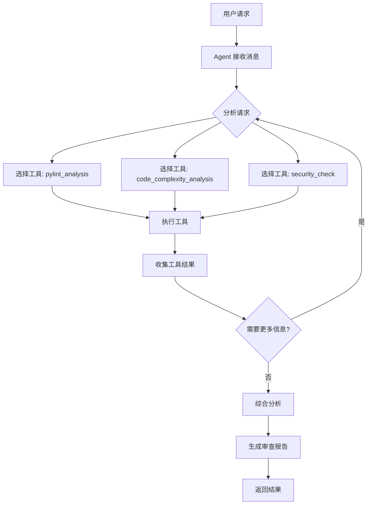

# 🤖 LangChain 1.0 Agent 架构文档

## 📋 概述

本项目已升级至 **LangChain 1.0** Agent 模式，使用官方推荐的 `create_agent` API，将代码审查功能从传统的 Chain 模式迁移到更灵活、可扩展的 Agent 架构。

## 🏗️ 架构设计

### 核心组件

```
CodeReviewChain (Agent)
├── LLM (ChatOpenAI)
├── Tools (工具集)
│   ├── PylintAnalysisTool (Python静态分析)
│   ├── CodeComplexityTool (复杂度分析)
│   └── SecurityCheckTool (安全检查)
└── System Prompt (系统提示)
```

### 与传统 Chain 的区别

| 特性 | 传统 Chain 模式 | Agent 模式 (LangChain 1.0) |
|------|----------------|---------------------------|
| **工具调用** | 需要手动编排 | Agent 自动决策调用 |
| **扩展性** | 修改代码逻辑 | 动态添加工具 |
| **灵活性** | 固定流程 | 自适应流程 |
| **推理能力** | 有限 | 强大的多步推理 |

## 🛠️ 工具系统

### 1. PylintAnalysisTool
- **功能**: Python 代码静态分析
- **输入**: 代码字符串、文件名
- **输出**: Pylint 分析报告（前15个问题）
- **错误处理**: 优雅降级，Pylint 未安装时给出提示

### 2. CodeComplexityTool
- **功能**: 代码复杂度分析
- **指标**: 总行数、代码行、注释行、嵌套深度、注释率
- **建议**: 基于阈值自动给出重构建议

### 3. SecurityCheckTool
- **功能**: 安全漏洞检测
- **检查项**: 
  - 代码注入风险 (eval, exec)
  - 反序列化安全 (pickle)
  - 硬编码敏感信息 (PASSWORD, API_KEY)
  - 命令注入风险 (os.system, subprocess)

### 4. 扩展工具示例

#### ESLintAnalysisTool (待实现)
```python
class ESLintAnalysisTool(BaseTool):
    """ESLint 分析工具（JavaScript/TypeScript）"""
    name: str = "eslint_analysis"
    description: str = """对 JavaScript/TypeScript 代码进行静态分析"""
    
    def _run(self, code: str, filename: str = "temp.js") -> str:
        # 实现 ESLint 分析逻辑
        pass
```

#### PerformanceAnalysisTool (待实现)
```python
class PerformanceAnalysisTool(BaseTool):
    """性能分析工具"""
    name: str = "performance_analysis"
    description: str = """分析代码的性能特征，识别潜在的性能瓶颈"""
    
    def _run(self, code: str, language: str = "python") -> str:
        # 实现性能分析逻辑（如时间复杂度分析）
        pass
```

## 📖 使用指南

### 基本使用

```python
from app.services.review_chain import review_chain

# 审查单个文件
result = await review_chain.review_code(
    code="def hello():\n    print('hello')",
    filename="test.py",
    language="python",
    user_question="这段代码有什么问题？"
)
print(result)
```

### 审查多个文件

```python
files = [
    {
        "filename": "main.py",
        "code": "...",
        "language": "python"
    },
    {
        "filename": "utils.py",
        "code": "...",
        "language": "python"
    }
]

result = await review_chain.review_multiple_files(
    files=files,
    user_question="整体架构是否合理？"
)
```

### 动态添加工具

```python
from app.services.review_chain import review_chain, ESLintAnalysisTool

# 添加 ESLint 工具
eslint_tool = ESLintAnalysisTool()
review_chain.add_tool(eslint_tool)

# 查看所有工具
print(review_chain.list_tools())
# 输出: ['pylint_analysis', 'code_complexity_analysis', 'security_check', 'eslint_analysis']
```

## 🔧 自定义工具开发

### 工具开发规范

1. **继承 BaseTool**
2. **定义 Pydantic 输入模型**
3. **实现 `_run` 方法**
4. **提供清晰的描述**

### 示例：创建自定义工具

```python
from langchain.tools import BaseTool
from pydantic import BaseModel, Field

class MyCustomInput(BaseModel):
    """自定义工具输入"""
    code: str = Field(description="代码内容")
    option: str = Field(default="default", description="选项")

class MyCustomTool(BaseTool):
    """自定义代码分析工具"""
    name: str = "my_custom_tool"
    description: str = """这是一个自定义工具的描述，
    Agent 会根据这个描述决定何时调用此工具。"""
    args_schema: type[BaseModel] = MyCustomInput
    
    def _run(self, code: str, option: str = "default") -> str:
        """执行工具逻辑"""
        # 实现你的分析逻辑
        result = f"分析结果: {len(code)} 字符"
        return result

# 使用自定义工具
from app.services.review_chain import review_chain

custom_tool = MyCustomTool()
review_chain.add_tool(custom_tool)
```

## 🎯 Agent 工作流程



## 📊 系统提示 (System Prompt)

Agent 的系统提示包含：

1. **角色定义**: 代码审查专家
2. **工具说明**: 可用工具列表及其用途
3. **审查流程**: 标准化的审查步骤
4. **审查维度**: 代码质量、性能、安全等
5. **输出格式**: Markdown 格式的结构化报告

## 🔄 从 Chain 迁移到 Agent 的变化

### 旧版 (Chain 模式)

```python
# 手动执行 Pylint
static_analysis = await self._run_pylint(code, filename)

# 构建输入数据
input_data = {
    "code": code,
    "static_analysis": static_analysis,
    # ...
}

# 执行固定的 Chain
result = await self.review_chain.ainvoke(input_data)
```

### 新版 (Agent 模式)

```python
# 构建用户消息（包含代码）
user_message = f"""请审查以下代码：
{code}
"""

# Agent 自动决定调用哪些工具
result = await self.agent.ainvoke({
    "messages": [{"role": "user", "content": user_message}]
})
```

## 🚀 后续扩展方向

### 1. 更多语言支持
- JavaScript/TypeScript (ESLint)
- Java (Checkstyle, PMD)
- Go (golint, go vet)
- C++ (cppcheck)

### 2. 高级分析工具
- **时间复杂度分析**: 自动分析算法复杂度
- **内存泄漏检测**: 识别潜在的内存问题
- **依赖分析**: 检查依赖关系和循环依赖
- **测试覆盖率**: 分析测试覆盖情况

### 3. AI 能力增强
- **代码修复建议**: 自动生成修复代码
- **重构建议**: 基于设计模式的重构
- **最佳实践推荐**: 针对特定场景的最佳实践

### 4. 集成外部服务
- **SonarQube**: 集成企业级代码质量平台
- **GitHub Copilot**: 代码补全和建议
- **CodeClimate**: 代码健康度评分

## 📝 配置说明

### 环境变量

```env
# OpenAI API 配置
OPENAI_API_KEY=your_api_key_here
OPENAI_MODEL=gpt-4o-mini
OPENAI_TEMPERATURE=0.2
OPENAI_MAX_TOKENS=8000
```

### 依赖包

```txt
langchain>=0.3.0
langchain-openai>=0.2.0
pydantic>=2.0.0
pylint>=3.0.0  # 可选，用于 Python 静态分析
```

## 🐛 故障排除

### 问题1: "未安装 Pylint"
**解决方案**: 
```bash
pip install pylint
```

### 问题2: "无法连接到 OpenAI API"
**检查项**:
1. OPENAI_API_KEY 是否正确配置
2. 网络连接是否正常
3. API 配额是否充足

### 问题3: 工具未被调用
**可能原因**:
1. 工具描述不清晰
2. 系统提示未引导 Agent 使用工具
3. LLM 模型能力限制

**解决方案**: 优化工具描述和系统提示

## 📚 参考资料

- [LangChain 1.0 Agents 官方文档](https://reference.langchain.com/python/langchain/agents/)
- [LangGraph 文档](https://langchain-ai.github.io/langgraph/)
- [BaseTool API 参考](https://python.langchain.com/docs/modules/tools/)

## 🤝 贡献指南

欢迎贡献新的工具或改进现有功能！

1. Fork 项目
2. 创建新分支: `git checkout -b feature/new-tool`
3. 实现你的工具
4. 添加测试
5. 提交 PR

---

**版本**: 2.0.0  
**更新日期**: 2025-11  
**维护者**: AI Code Review Team

